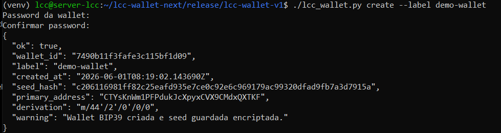
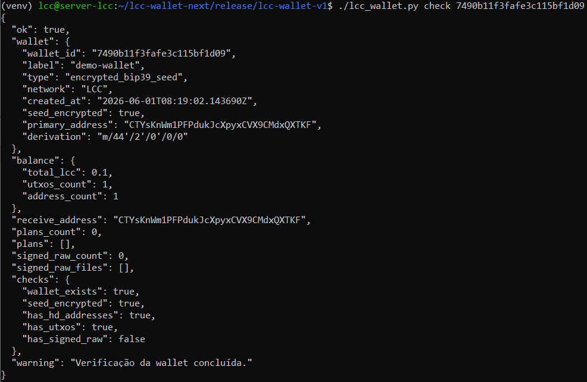
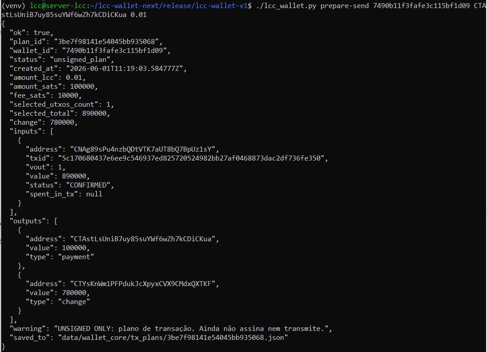
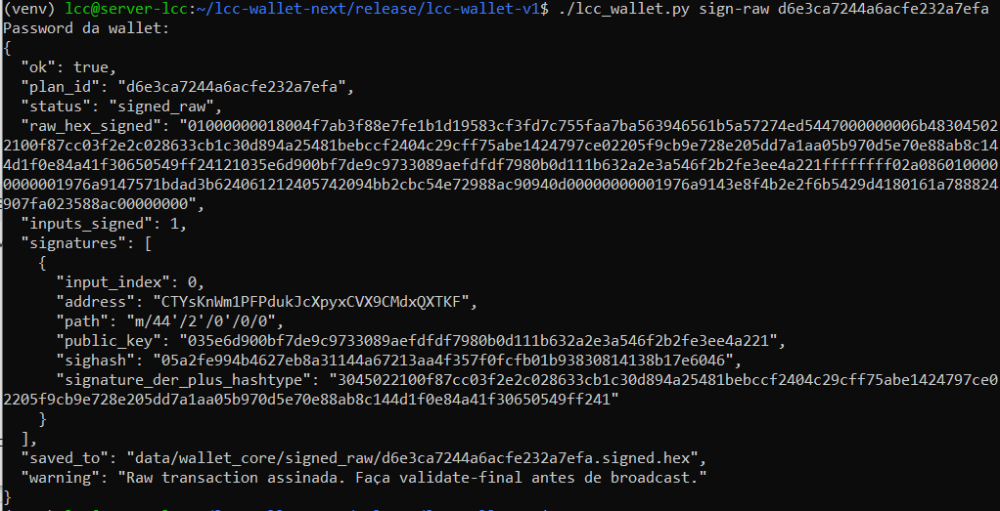
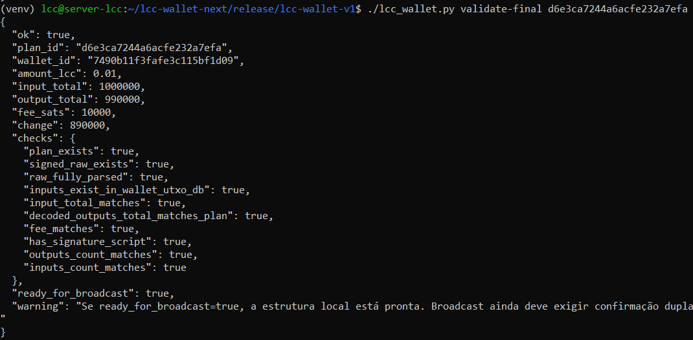
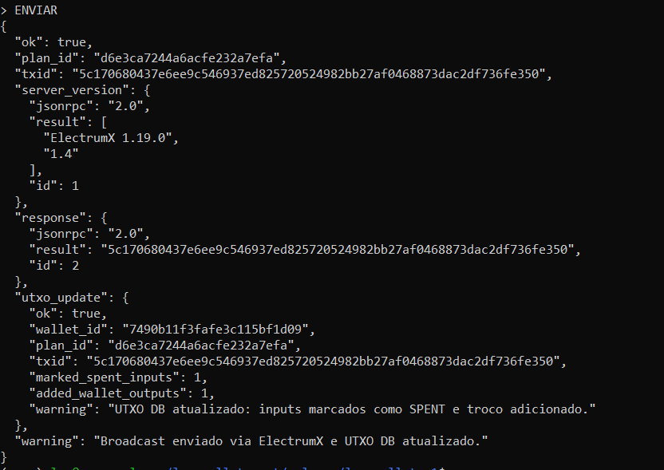

# LitecoinCash Electrum Wallet

Community Electrum-style wallet for Litecoin Cash (LCC).

## Features

- BIP39 mnemonic wallets
- HD wallet derivation
- Encrypted seed storage
- Legacy LCC addresses (C...)
- Send to legacy addresses
- Send to SegWit addresses (lcc1...)
- ElectrumX backend support
- Local UTXO tracking
- Transaction preparation
- Raw transaction signing
- Transaction validation
- Transaction broadcast

## Current Status

### Supported

- Create wallets
- Import wallets
- Export encrypted backups
- Receive with C... addresses
- Spend from C... addresses
- Send to lcc1... addresses
- ElectrumX synchronization

### Planned

- Native lcc1 wallet accounts
- Spending from lcc1 UTXOs
- Desktop Wallet for Windows
- Desktop Wallet for Linux
- Google encrypted backup integration
- Full SegWit wallet support

## Installation
Quick Start

Create a wallet:

./lcc_wallet.py create

Check wallet status and balance:

./lcc_wallet.py check WALLET_ID

Prepare a transaction:

./lcc_wallet.py prepare-send WALLET_ID DESTINATION_ADDRESS AMOUNT

Sign transaction:

./lcc_wallet.py sign-raw PLAN_ID

Broadcast transaction via ElectrumX:

./lcc_wallet.py broadcast-electrumx PLAN_ID

```bash
python3 -m venv venv
source venv/bin/activate
pip install -r requirements.txt
uvicorn api.wallet_api:app --host 0.0.0.0 --port 8080
curl http://127.0.0.1:8080/
```

## Security

This is a non-custodial wallet.

Users must securely store their seed phrase.

Never share your seed phrase with anyone.

Always test with small amounts before storing significant funds.

## License

MIT License

## Community

Litecoin Cash Community Project.

## Screenshots

### Create Wallet



### Check Wallet



### Prepare Transaction



### Sign Transaction



### Validate Transaction



### Broadcast via ElectrumX



